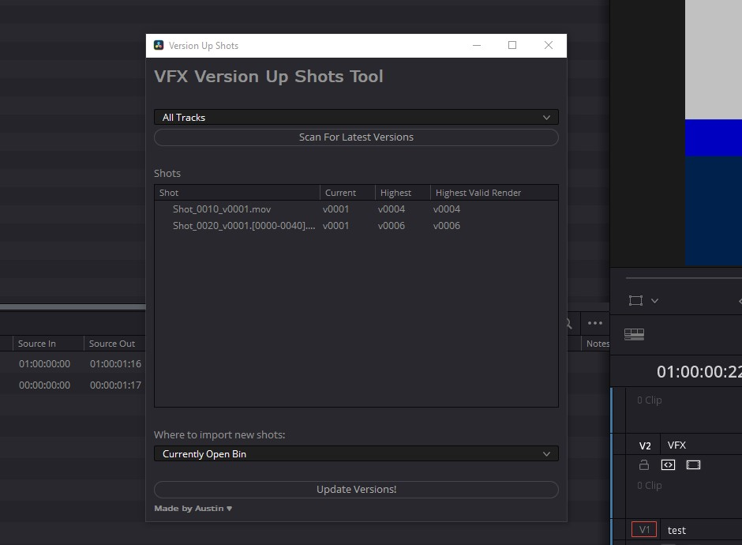

# resolve-version-up-shots
A tool for VFX Editors to version up shots on their resolve timelines quickly.

USAGE:
Run the tool by going to Workspace->Scripts->Version Up Shots
Select the video track you want to scan for shots on and Scan for Versions.
It should automatically detect newer versions of that shot (as long as the naming/directory structure is the same) and show you version numbers.
If you're happy with the versions it found, press 'Update Shots' to swap out clips on your timeline.

NOTE: At the moment, this tool uses frame numbers to swap out, not timecode. If your shots change frame numbers, it may not relink correctly.

INSTALLATION:
Download the .py file and insert into `C:\ProgramData\Blackmagic Design\DaVinci Resolve\Fusion\Scripts\Edit` or the equivelent on your OS.

---
Only tested on Resolve 17 Studio on Windows 10. Should work on other operating systems, but I don't have access to test.
Requires python to be installed on your computer, and Resolve able to access it.

You made need to enable Local or Network script access in DaVinci Resolve -> Preferences -> General -> External Scripting
